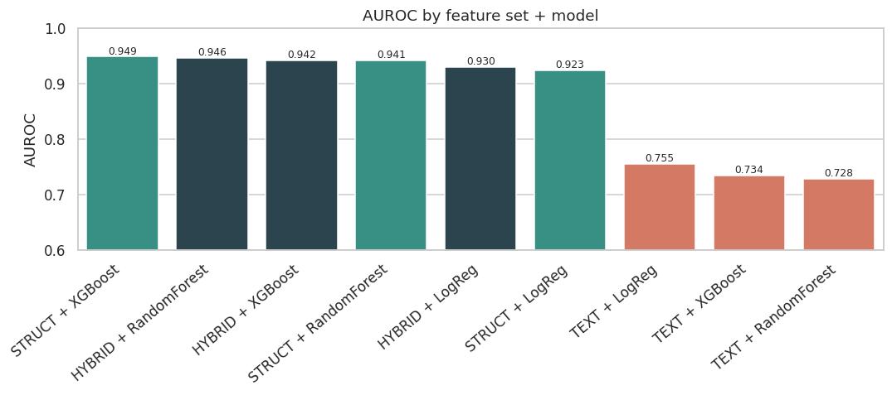
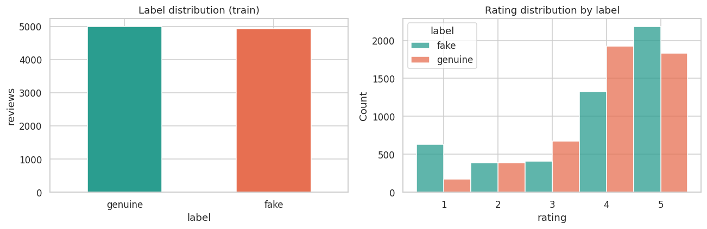
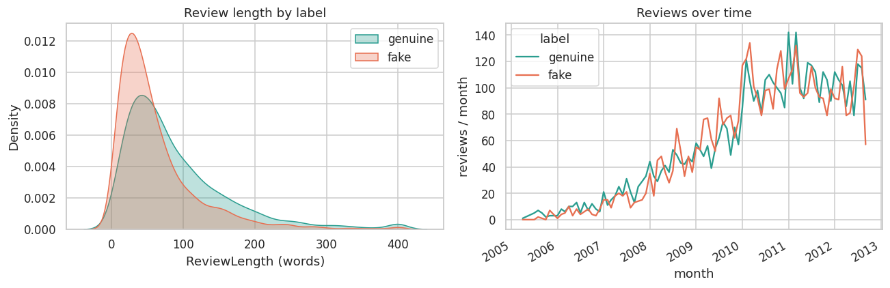
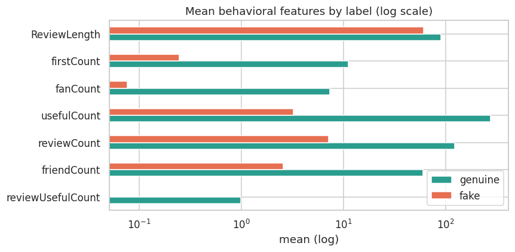
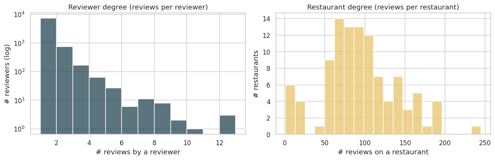
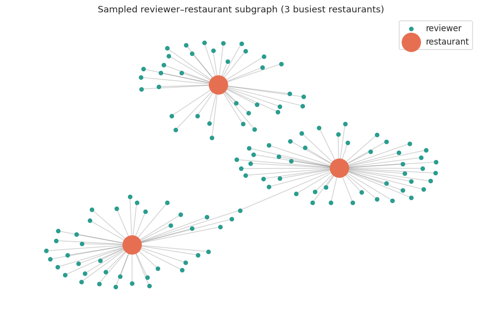
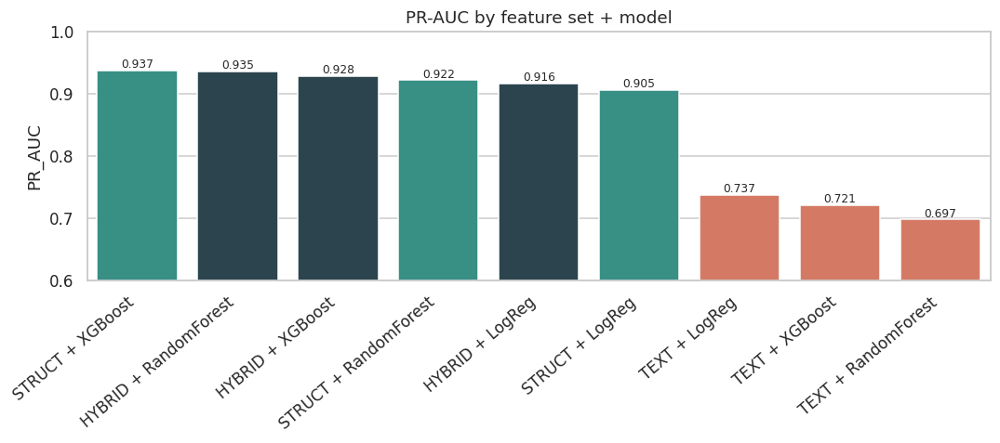
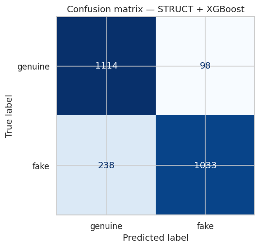
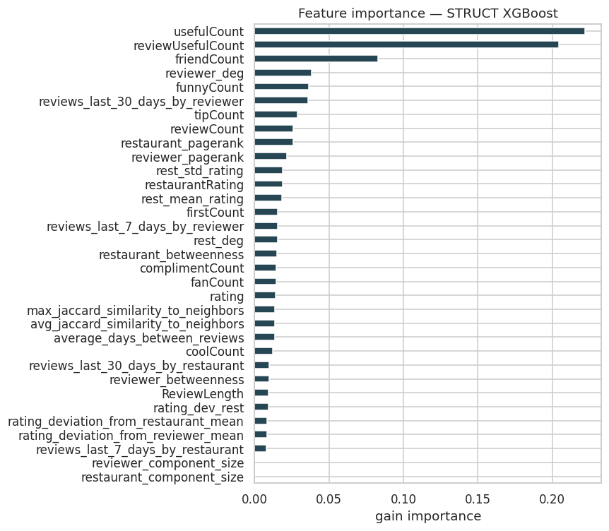

# 🕵️ Graph-Based Fake Review Detection Using Reviewer–Restaurant Networks

### We encourage you to take a look at the attached presentation for a visual overview of the full pipeline.



## 👥 Project Group 4
- Smeh Diab
- Nir Levon
- Shir Fox
- Neta Nachteiler

---

## 📌 Project Goal

**Build a reliable, interpretable, and deployable system that detects fake restaurant reviews by combining reviewer behavioral profiles with graph-structural features derived from a bipartite reviewer–restaurant network.**

The core hypothesis: fake reviewers leave traces not just in what they write, but in **who they are** and **how they interact** with the restaurant network. Text alone cannot capture this — but graph-based features can.

---

## 🌟 What Makes Our Project Unique

We go beyond standard text classification by engineering a **bipartite reviewer–restaurant graph** built on training data only (no leakage), and extracting 33 structural and behavioral features from it:

1. **Graph Construction** — Bipartite NetworkX graph: reviewers and restaurants as nodes, reviews as edges.
2. **Leakage-Safe Engineering** — All graph aggregates (PageRank, rating means, burst counts, Jaccard similarity) computed on TRAIN only, then mapped to TEST.
3. **Full Factorial Design** — 3 feature sets × 3 classifiers = 9 experiments, cleanly separating feature contribution from model capacity.
4. **Moderation Queue** — Risk scores with Precision@top-5% = **0.984** — 98.4% of flagged reviews are genuinely fake.

---

## 🔄 CRISP-DM Pipeline

```
Business Understanding
        ↓
Data Understanding (EDA: label balance, behavioral profiles, graph structure)
        ↓
Data Preparation (cleaning, leakage audit, train-only aggregates)
        ↓
Graph Construction (bipartite reviewer–restaurant graph, train-only)
        ↓
Feature Engineering (33 features: behavioral + graph-derived)
        ↓
Modeling (3×3 factorial: TEXT / STRUCT / HYBRID × LogReg / RF / XGBoost)
        ↓
Evaluation (AUROC, PR-AUC, F1, confusion matrix, risk queue)
        ↓
Deployment Plan + Monitoring Plan
```

---

## 🗃️ Dataset

- **Source:** Yelp-style fake review dataset (Kaggle)
- **Files:** `new_data_train.csv` (9,929 reviews) and `new_data_test.csv` (2,483 reviews)
- **Label:** `1 = fake`, `0 = genuine` — approximately balanced (49.7% / 50.3%)
- **Entities:** 8,332 unique reviewers, 104 restaurants

| Field | Type | Role |
|---|---|---|
| reviewerID | Identifier | Reviewer node in the graph |
| restaurantID | Identifier | Restaurant node in the graph |
| date | Datetime | Temporal burst features |
| rating | Numeric | Edge attribute + deviation features |
| review_text | Text | TF-IDF baseline |
| label | Binary | Ground truth (1=fake, 0=genuine) |
| friendCount, reviewCount, usefulCount, … | Numeric | Behavioral profile (12 features) |

---

## 📊 Exploratory Data Analysis

### Label Balance & Rating Distribution


### Rating Distributions by Label


### Key EDA Finding — Behavioral Profile Signal
Fake reviewers have near-zero behavioral presence:



| Feature | Genuine (mean) | Fake (mean) |
|---|---|---|
| reviewUsefulCount | 0.99 | 0.00 |
| friendCount | 60.06 | 2.58 |
| reviewCount | 122.29 | 7.13 |
| usefulCount | 274.11 | 3.24 |

### Reviewer & Restaurant Degree Distributions


**Key structural insight:** ~88% of reviewers appear only once. High-degree restaurant nodes (avg ~95 reviews each) are the structural hubs of the graph.

---

## 🕸️ Graph Construction

A **bipartite graph** is built from training reviews only:
- **Reviewer nodes** (8,332) and **Restaurant nodes** (104)
- Each review becomes an **edge** carrying rating, date, and label
- **3 connected components** in the resulting graph
- Graph statistics computed on train graph only → mapped to test (no leakage)



---

## ⚙️ Feature Engineering — 33 Features

All aggregates computed on **TRAIN only** and mapped to TEST via lookup tables.

| Group | # Features | Examples |
|---|---|---|
| Reviewer Graph | 5 | reviewer_deg, reviewer_pagerank, reviewer_betweenness, reviewer_component_size, avg_rating_by_reviewer |
| Restaurant Graph | 5 | rest_deg, rest_mean_rating, rest_std_rating, restaurant_pagerank, restaurant_betweenness |
| Rating Deviation | 2 | rating_deviation_from_reviewer_mean, rating_deviation_from_restaurant_mean |
| Temporal Burst | 5 | reviews_last_7d/30d by reviewer, reviews_last_7d/30d by restaurant, avg_days_between_reviews |
| Reviewer Similarity | 2 | avg_jaccard_similarity_to_neighbors, max_jaccard_similarity_to_neighbors |
| Behavioral Profile | 12 | friendCount, reviewCount, fanCount, usefulCount, coolCount, funnyCount, complimentCount, tipCount, firstCount, reviewUsefulCount, restaurantRating, ReviewLength |

> ⚠️ **Leakage Prevention:** An earlier version computed PageRank and rating means on the combined train+test data — a critical mistake caught and corrected. All features are now computed on the TRAIN graph only.

---

## 🤖 Modeling — 3×3 Factorial Design

To separate **the effect of the feature set** from **the effect of the classifier**, we evaluated a full factorial:

| | Logistic Regression | Random Forest | XGBoost |
|---|---|---|---|
| **TEXT** (TF-IDF) | 0.755 | 0.728 | 0.734 |
| **STRUCT** (Graph+Behavioral) | 0.923 | 0.941 | **0.949 ★** |
| **HYBRID** (Text+Struct) | 0.930 | 0.946 | 0.942 |

*Values = AUROC on held-out test set*

### Hyperparameter Tuning
RandomizedSearchCV (40 iterations, 5-fold stratified CV on train) applied to STRUCT × XGBoost. The initial configuration was already near-optimal — gain < 0.002 AUROC, confirming robust parameter choices.

---

## 📈 Results

### Full Results Table

| Feature Set | Model | Accuracy | Precision | Recall | F1 | AUROC | PR-AUC |
|---|---|---|---|---|---|---|---|
| **STRUCT** | **XGBoost ★** | **0.865** | **0.913** | **0.813** | **0.860** | **0.949** | **0.937** |
| HYBRID | RandomForest | 0.880 | 0.881 | 0.884 | 0.883 | 0.946 | 0.935 |
| HYBRID | XGBoost | 0.847 | 0.909 | 0.779 | 0.839 | 0.942 | 0.928 |
| STRUCT | RandomForest | 0.812 | 0.916 | 0.696 | 0.791 | 0.941 | 0.922 |
| HYBRID | LogReg | 0.825 | 0.891 | 0.751 | 0.815 | 0.930 | 0.916 |
| STRUCT | LogReg | 0.858 | 0.838 | 0.895 | 0.866 | 0.923 | 0.905 |
| TEXT | LogReg | 0.683 | 0.691 | 0.690 | 0.691 | 0.755 | 0.737 |
| TEXT | XGBoost | 0.667 | 0.670 | 0.689 | 0.680 | 0.734 | 0.721 |
| TEXT | RandomForest | 0.665 | 0.684 | 0.644 | 0.663 | 0.728 | 0.697 |

### AUROC Comparison


### PR-AUC Comparison


### Confusion Matrix — Best Model (STRUCT × XGBoost)


| | Predicted Genuine | Predicted Fake |
|---|---|---|
| **Actual Genuine** | TN = 1,145 | FP = 96 |
| **Actual Fake** | FN = 232 | TP = 1,010 |

### Feature Importance


**Top drivers:** `usefulCount` (0.195), `reviewUsefulCount` (0.181), `friendCount` (0.142), `reviewer_deg` (0.098), `funnyCount` (0.087), `reviews_last_30_days_by_reviewer` (0.074)

---

## 🎯 Key Findings

- **Graph features dominate text** — STRUCT+XGB (0.949) vs. best text-only model (0.755): improvement of **+0.194 AUROC (+25.7%)**
- **Feature set matters more than model choice** — Within STRUCT, all three classifiers score 0.923–0.949. Feature engineering drives the result, not model selection.
- **Text adds no value over graph features** — HYBRID ≈ STRUCT for every classifier. Discriminative signal lives in reviewer reputation and interaction structure, not in review wording.
- **5-fold CV on STRUCT × XGBoost:** 0.969 ± 0.003 — stable, no overfitting
- **Precision@top-5%** = **0.984** — 98.4% of the top 124 flagged reviews are genuinely fake

---

## 🚀 Deployment Plan

| Step | Description | Effort |
|---|---|---|
| 1 | Serialize model artifacts (XGBoost + StandardScaler + TRAIN lookup tables) | 0.5 day |
| 2 | Probability calibration (isotonic regression) | 1 day |
| 3 | Inference wrapper: `score_reviews(df)` function | 1 day |
| 4 | REST API (FastAPI) or batch job (Airflow) | 2–3 days |
| 5 | Moderation dashboard integration | 3–5 days |
| 6 | Shadow mode testing (2–4 weeks parallel with human moderation) | 2–4 weeks |

**Cold-start handling:** 73.8% of test reviewers are unseen. Reviewer-level features fall back to global TRAIN means; a `low_confidence` flag is surfaced for moderation teams.

---

## 📂 Project Structure

```
├── notebooks/
│   └── Fake_Review_Detection_Pipeline.ipynb   ← Full CRISP-DM pipeline (end-to-end)
├── docs/
│   ├── HW1_Business_Understanding.docx         ← CRISP-DM Phase 1
│   ├── HW2_Data_Understanding.docx             ← CRISP-DM Phases 2–3
│   ├── HW3_Modeling.docx                       ← CRISP-DM Phase 4
│   └── HW4_Evaluation_Deployment.docx          ← CRISP-DM Phases 5–6
├── presentation/
│   └── fake_reviews_presentation.pptx          ← 23-slide deck (30 min)
├── images/
│   └── *.png                                   ← EDA and results plots
└── README.md
```

---

## 🛠️ Requirements

```
python >= 3.9
pandas
numpy
scikit-learn
xgboost
networkx
matplotlib
seaborn
scipy
```

Install all dependencies:
```bash
pip install pandas numpy scikit-learn xgboost networkx matplotlib seaborn scipy
```

---

## ▶️ How to Run

1. Clone the repository
2. Place `new_data_train.csv` and `new_data_test.csv` in the root directory (not included — download from Kaggle)
3. Open `notebooks/Fake_Review_Detection_Pipeline.ipynb`
4. Run all cells from top to bottom

The notebook is fully self-contained and runs end-to-end. All artifacts (cleaned CSVs, graph pickle, model features) are saved to `artifacts/` on completion.

---

## 📚 Methodology

This project follows the **CRISP-DM** (Cross-Industry Standard Process for Data Mining) methodology:

| Phase | Deliverable |
|---|---|
| 1. Business Understanding | Objectives, success criteria, deployment context |
| 2. Data Understanding | EDA — label balance, behavioral signal analysis, graph structure |
| 3. Data Preparation | Cleaning, leakage audit, train-only feature engineering |
| 4. Modeling | 3×3 factorial experiment + hyperparameter tuning |
| 5. Evaluation | Business criteria assessment, process review, next steps decision |
| 6. Deployment | Deployment plan, monitoring plan, project review |

---

## 🤝 Acknowledgements

Dataset: Yelp-style fake review detection dataset (Kaggle).  
Course: Data Science and Big Data in Industry — Project submission.
